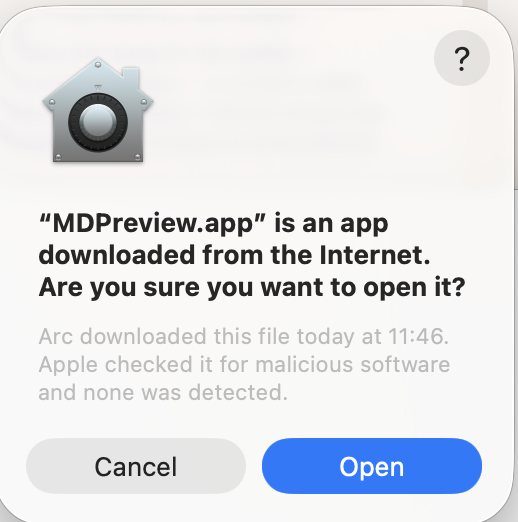
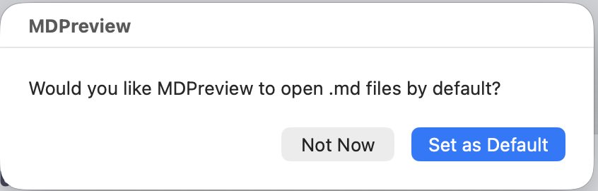
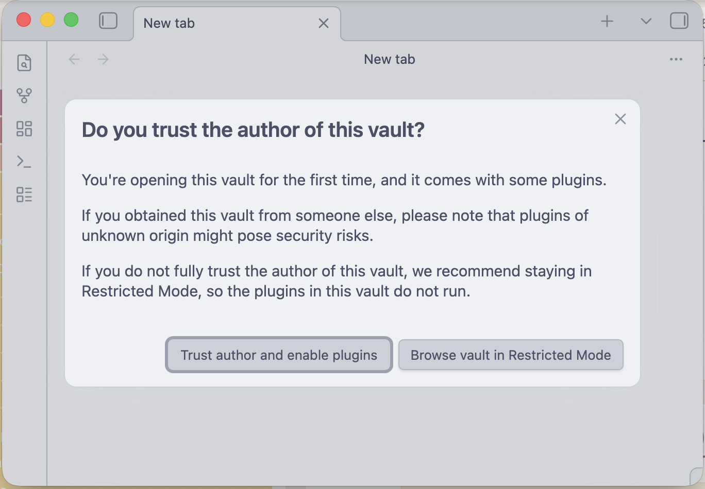

# md-preview

Open any Markdown file in Obsidian — even files outside any vault — with a double-click or right-click. Files are symlinked into a dedicated `MDPreview/` vault and opened instantly.

**macOS:** double-click, Finder Quick Action, or terminal. Reading mode switches automatically.  
**Windows:** right-click in Explorer or PowerShell. Press `Ctrl+E` for reading mode.

## Requirements

- [Obsidian](https://obsidian.md) installed
- **macOS:** 10.15 Catalina or later
- **Windows:** Windows 10 or later (PowerShell 5.1 is built in)

---

## Install — macOS

**Option A — DMG (recommended)**

1. Download `MDPreview.dmg` from [Releases](https://github.com/ReutFarkash/MDpreview/releases)
2. Open the DMG and drag **MDPreview.app** to **Applications**
3. Double-click MDPreview.app — it sets up `~/MDPreview` automatically on first run

**First-run prompts — all expected:**

**1. Click Open** — Apple has already scanned it for malicious software.



**2. Click Set as Default** — lets you double-click `.md` files to open them in MDPreview.

> ⚠️ This dialog can appear behind Obsidian's window. If you don't see it, look behind the trust prompt below.



**3. Click Trust author and enable plugins** — required for the AnuPpuccin theme to load.



To also get the Finder right-click action, clone the repo and run `bash install.sh`.

**Option B — from source**

```bash
# 1. Set up the vault
bash setup.sh

# 2. Install the app + Finder Quick Action
bash install.sh
```

### macOS setup options

| Command | Theme | Plugins |
|---|---|---|
| `bash setup.sh` | Plain Obsidian | None |
| `bash setup.sh --theme bundled` | AnuPpuccin (bundled) | Style Settings |
| `bash setup.sh --theme bundled --full --vault /path` | AnuPpuccin | Dataview, Excalidraw, + more |
| `bash setup.sh --theme vault --vault /path/to/vault` | Your vault's theme | Style Settings only |
| `bash setup.sh --theme vault --full --vault /path/to/vault` | Your vault's theme | All your vault's plugins |

`--vault` can be omitted if your vault is in a standard location (iCloud Obsidian folder, `~/Obsidian/`, etc.).

### macOS first-run permissions

- **Accessibility (for reading mode):** System Settings → Privacy & Security → Accessibility → enable **Finder**

---

## Install — Windows

### Quick start

```powershell
git clone https://github.com/ReutFarkash/MDpreview.git
cd MDpreview

.\setup.ps1     # creates %USERPROFILE%\MDPreview vault, registers with Obsidian
.\install.bat   # adds "Open in MDPreview" to right-click context menu
```

When Obsidian opens, click **Trust author and enable plugins** if prompted.

### Windows setup options

| Command | Theme | Plugins |
|---|---|---|
| `.\setup.ps1` | AnuPpuccin (bundled) | Style Settings |
| `.\setup.ps1 -Theme plain` | Plain Obsidian | None |
| `.\setup.ps1 -Theme bundled -Full -Vault C:\path` | AnuPpuccin | Dataview, Excalidraw, + more |
| `.\setup.ps1 -Theme vault -Vault C:\path\to\vault` | Your vault's theme | Style Settings only |
| `.\setup.ps1 -Theme vault -Full -Vault C:\path\to\vault` | Your vault's theme | All your vault's plugins |

`-Vault` can be omitted if your vault is in `%USERPROFILE%\Obsidian\` or `%USERPROFILE%\Documents\Obsidian\`.

### Windows notes

- **Reading mode:** press `Ctrl+E` in Obsidian (auto-toggle is macOS-only for now)
- **Symlinks** require Developer Mode (Settings → Privacy & Security → For developers). Without it, md-preview copies the file instead — changes to the original won't reflect until you open it again.
- **Context menu entry** is per-user (HKCU registry) — no admin rights required. To remove it: `Remove-Item -Recurse 'HKCU:\Software\Classes\*\shell\Open in MDPreview'`

---

## Usage

### macOS

**Double-click** any `.md` file (after setting MDPreview as default — see below).

**Right-click** any `.md` file in Finder → **Open in MDPreview** (bottom of context menu).

**Terminal:**
```bash
bash /path/to/md-preview/md-preview.sh /path/to/file.md
```

Add an alias in `~/.bashrc`:
```bash
alias md-preview='bash /path/to/md-preview/md-preview.sh'
```

### Windows

**Right-click** any file in Explorer → **Open in MDPreview** (after `install.bat`).

**PowerShell:**
```powershell
.\md-preview.ps1 C:\path\to\file.md
```

---

## Set as default app for .md files (macOS)

On first launch from the DMG, MDPreview will ask automatically — click **Set as Default**.

If you skipped it or installed from source:

**Option A — Finder:**
Right-click any `.md` file → Get Info → Open With → select MDPreview → Change All...

**Option B — Terminal:**
```bash
/Applications/MDPreview.app/Contents/Resources/set-default
```

---

## How it works

1. Resolves the absolute path of your file
2. Symlinks it into `~/MDPreview/<filename>.md` (original file is never modified)
3. Opens `obsidian://open?vault=MDPreview&file=<filename>`
4. **macOS:** switches Obsidian to reading mode via AppleScript. **Windows:** press `Ctrl+E` manually.

**Symlinks accumulate** in `~/MDPreview/` — delete them whenever. The originals are never touched.

**Same filename from different folders:** the symlink is overwritten with the latest file.

---

## Files

```
md-preview/
├── md-preview.sh              # macOS core script
├── md-preview.ps1             # Windows core script
├── setup.sh                   # macOS vault setup
├── setup.ps1                  # Windows vault setup
├── install.sh                 # macOS app + Quick Action installer
├── install.ps1                # Windows context menu installer (registry)
├── install.bat                # Windows double-click wrapper for install.ps1
├── build-dmg.sh               # build macOS distributable DMG
├── automator/
│   └── MDPreview.applescript  # source for MDPreview.app (macOS)
└── vault-config/
    ├── bundled/.obsidian/     # AnuPpuccin theme + Style Settings
    ├── plain/.obsidian/       # bare Obsidian config
    ├── plugins-minimal.json   # ["obsidian-style-settings"]
    └── plugins-full.json      # Dataview, Excalidraw, Icon Shortcodes, etc.
```
